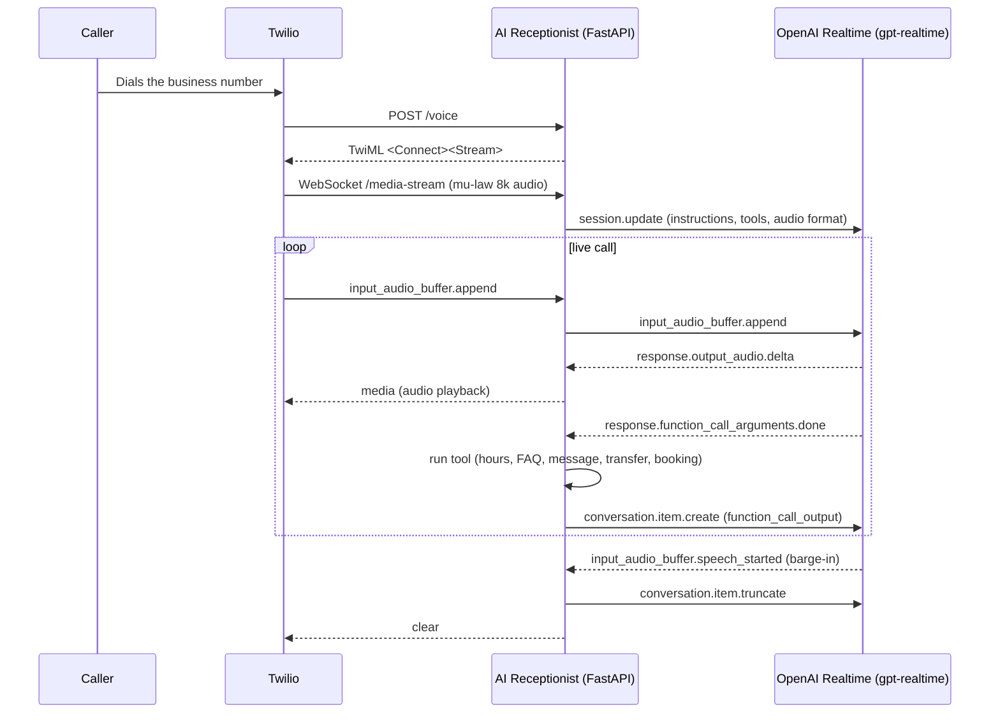

# AI Receptionist: open source AI phone receptionist starter (Twilio + OpenAI Realtime)

**AI Receptionist is an open source, self-hosted starter kit for building an inbound AI phone receptionist with Twilio and the OpenAI Realtime API.**

[](https://github.com/jbrazy480/ai-receptionist/actions/workflows/ci.yml)
[](LICENSE)
[](https://www.python.org/)
[](https://aiguyofficial.com/resources?utm_source=github&utm_medium=readme&utm_campaign=ai-receptionist)


## What it does

- Answers inbound calls to a Twilio number and bridges the caller's audio to OpenAI's Realtime speech-to-speech API and back.
- Supports barge-in: if the caller starts talking while the assistant is speaking, playback is truncated and Twilio's buffer is cleared.
- Builds its whole personality and knowledge from one `business.yaml` file: business name, greeting, voice, timezone, weekly hours, after-hours message, FAQs, departments, and where to send messages and bookings.
- Gives the model real tools to act on: look up hours, answer FAQs, take a message, transfer to a department, book an appointment, end the call.
- Detects after-hours automatically in the business's configured timezone and switches to message-taking instead of live transfers.
- Logs every call (SID, masked caller number, start/end, tool calls) to `data/calls.jsonl`.
- Ships an offline text simulator so you can try the whole flow in about 60 seconds with no API keys and no network access.

## Who this is for

Developers building or evaluating an AI phone receptionist for a local business, dental office, med spa, law firm intake line, or home services company, who want to see the real Twilio + OpenAI Realtime wiring before committing to a hosted platform.

## Quickstart

### (a) 60-second offline demo, no keys

```bash
git clone https://github.com/jbrazy480/ai-receptionist.git
cd ai-receptionist
python3 -m venv .venv && source .venv/bin/activate
pip install -r requirements-dev.txt
python -m receptionist.simulate
```

This runs a scripted conversation against a rule-based "brain" that calls the exact same tool implementations (FAQ lookup, hours, take a message, book an appointment, transfer in dry-run) as the live phone bridge. No `business.yaml` is required for the demo; it falls back to `business.example.yaml`. Add `--interactive` to type your own messages.

### (b) Real phone calls: Twilio + OpenAI + a tunnel

```bash
cp business.example.yaml business.yaml   # edit for your business
cp .env.example .env                     # fill in real keys
pip install -r requirements.txt

# expose your local server, e.g. with cloudflared or ngrok
cloudflared tunnel --url http://localhost:5050
# or: ngrok http 5050

python -m receptionist.check             # verify config + env vars
python -m receptionist.twilio_app        # start the server on $PORT (default 5050)
```

Then in the Twilio console, set your phone number's "A call comes in" webhook to `https://YOUR_TUNNEL_HOST/voice` (HTTP POST).

## Configuration

### Environment variables

| Variable | Required for | Description |
|---|---|---|
| `OPENAI_API_KEY` | live calls | OpenAI API key with Realtime access |
| `TWILIO_ACCOUNT_SID` | live calls, transfers | Twilio account SID |
| `TWILIO_AUTH_TOKEN` | live calls, signature validation | Twilio auth token |
| `VALIDATE_TWILIO_SIGNATURE` | optional | `"false"` disables webhook signature checks for local dev; default `"true"` |
| `BUSINESS_CONFIG_PATH` | optional | Path to your config file; default `business.yaml` |
| `PORT` | optional | Port for the FastAPI server; default `5050` |
| `LOG_LEVEL` | optional | Python logging level; default `INFO` |

### business.yaml

Copy `business.example.yaml` to `business.yaml` and edit it. It is validated on startup with pydantic; invalid values (bad time formats, unknown timezones, malformed phone numbers, missing weekdays) produce a clear error message pointing at the exact field.

Sections: `business` (name, timezone, greeting, after-hours message, voice), `hours` (per weekday, `null` for closed), `faqs` (question/answer pairs), `departments` (name + E.164 phone number for transfers), `booking` (optional webhook URL, else appointments are saved to `data/bookings.jsonl`), `messages` (JSONL file path and optional webhook URL).

## Architecture



See [docs/architecture.svg](docs/architecture.svg) for a static diagram.

## How does the AI receptionist transfer a call?

The `transfer_call` tool looks up the department in `business.yaml`, checks that the business is currently open (using the configured timezone), and if so returns a short spoken handoff line. Once the assistant finishes speaking that line, the server uses the Twilio REST API to update the live call with a `<Dial>` to the department's phone number. Outside business hours, the tool refuses to transfer and the assistant offers to take a message instead.

## How does the AI receptionist handle after-hours calls?

`receptionist.hours.is_after_hours` compares the current time, converted into the business's configured IANA timezone, against that weekday's configured hours. When closed, the system prompt instructs the model to use the after-hours message and take a message rather than offering a transfer, and the `transfer_call` tool independently refuses to transfer as a safety net.

## How much does it cost to run?

Costs come from three places you control directly: your Twilio phone number and per-minute call charges (see [Twilio Voice pricing](https://www.twilio.com/en-us/voice/pricing)), OpenAI Realtime API usage (see [OpenAI pricing](https://openai.com/api/pricing/)), and wherever you host this server. This repo does not add its own fees and this README does not estimate a total, since it depends entirely on your call volume and provider rates.

## Testing

```bash
pip install -r requirements-dev.txt
pytest
```

Tests run fully offline with no API keys and no network calls. They cover:

- `business.yaml` validation (pydantic error messages for bad hours, timezones, phone numbers)
- business hours and after-hours logic across timezones and weekdays
- each realtime tool function (hours, FAQ lookup, take message, transfer, booking, end call)
- TwiML generation for `POST /voice`
- Twilio webhook signature validation, both enabled and disabled
- the realtime bridge's event handling, using a fake OpenAI websocket and a fake Twilio websocket: audio delta forwarding, barge-in truncate/clear, and the function-call round trip
- the offline text simulator end to end

## Compliance note (not legal advice)

Calling real people with an AI voice is regulated. In the United States, the FCC has ruled that AI-generated voices used in robocalls fall under the Telephone Consumer Protection Act's (TCPA) "artificial or prerecorded voice" restrictions, which generally require prior consent before calling. This starter only handles inbound calls that the caller initiated, but if you extend it to place outbound calls, review TCPA requirements and applicable state law with counsel before doing so. This is general information, not legal advice.

## Comparison

| | This starter | Building from scratch | A hosted platform |
|---|---|---|---|
| Setup time | Minutes to an offline demo, hours to a live call | Weeks | Minutes |
| Twilio + Realtime wiring | Included, MIT licensed | You write it | Managed for you |
| Hosting | You run it | You run it | Managed for you |
| Customization | Full source access | Full source access | Limited to platform features |
| Multi-number / CRM / dialer | Not included | You build it | Varies by platform |

## FAQ

**Do I need an OpenAI Realtime-enabled account?** Yes, live calls require an OpenAI API key with access to the Realtime API.

**Can I try this without a Twilio account?** Yes. `python -m receptionist.simulate` runs the full conversation logic offline with no keys.

**Does barge-in actually work?** Yes. When OpenAI reports `input_audio_buffer.speech_started`, the server sends `conversation.item.truncate` for the in-progress assistant item and clears Twilio's playback buffer, so the caller can interrupt naturally.

**Where do messages and bookings go?** To JSONL files under `data/` by default (`data/messages.jsonl`, `data/bookings.jsonl`), or to a webhook URL if you configure one in `business.yaml`.

**Can I add more tools or departments?** Yes. Departments and FAQs are just list entries in `business.yaml`. Additional tools go in `receptionist/tools.py` and `receptionist/realtime_bridge.py`.

**Is my caller data sent anywhere besides OpenAI and Twilio?** Only if you configure a booking or message webhook URL yourself. Otherwise everything stays local in `data/`.

## Going further

Free resources, templates, and community: https://aiguyofficial.com/resources?utm_source=github&utm_medium=readme&utm_campaign=ai-receptionist

When you need this across many client numbers with a dialer and CRM built in, RizzDial is a commercial platform for that: https://rizzdial.com/ai-calling-api?utm_source=github&utm_medium=readme&utm_campaign=ai-receptionist

## License

MIT License (this starter repo only, see [LICENSE](LICENSE)).

Maintained by James Hill (The AI Guy).
