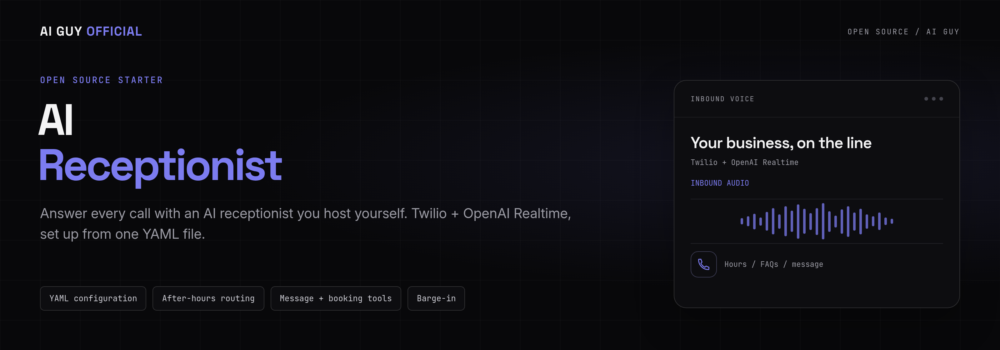
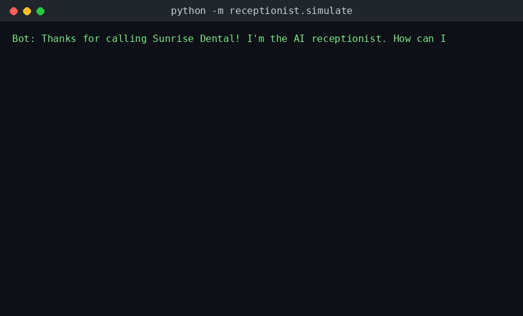
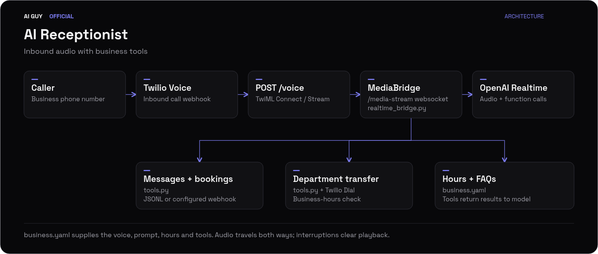

<p align="center">
  
</p>

<p align="center"><strong>Answer every call with an AI receptionist you host yourself. Twilio + OpenAI Realtime, set up from one YAML file.</strong></p>

<p align="center">
  <a href="https://github.com/jbrazy480/ai-receptionist/actions/workflows/ci.yml?utm_source=github&amp;utm_medium=readme&amp;utm_campaign=ai-receptionist&amp;utm_content=ci"></a>
  <a href="https://github.com/jbrazy480/ai-receptionist/blob/main/LICENSE?utm_source=github&amp;utm_medium=readme&amp;utm_campaign=ai-receptionist&amp;utm_content=license"></a>
  <a href="https://www.python.org/?utm_source=github&amp;utm_medium=readme&amp;utm_campaign=ai-receptionist&amp;utm_content=python"></a>
  <a href="https://github.com/jbrazy480/ai-receptionist/blob/main/receptionist/twilio_app.py?utm_source=github&amp;utm_medium=readme&amp;utm_campaign=ai-receptionist&amp;utm_content=twilio"></a>
  <a href="https://github.com/jbrazy480/ai-receptionist/blob/main/receptionist/realtime_bridge.py?utm_source=github&amp;utm_medium=readme&amp;utm_campaign=ai-receptionist&amp;utm_content=realtime"></a>
  <a href="https://www.skool.com/evolving-ai-hub?utm_source=github&amp;utm_medium=readme&amp;utm_campaign=ai-receptionist&amp;utm_content=community"></a>
  <a href="https://rizzdial.com/booked?utm_source=github&amp;utm_medium=readme&amp;utm_campaign=ai-receptionist&amp;utm_content=done-for-you"></a>
</p>

<p align="center">
  <a href="https://www.skool.com/evolving-ai-hub?utm_source=github&amp;utm_medium=readme&amp;utm_campaign=ai-receptionist&amp;utm_content=community"></a>
  <a href="https://rizzdial.com/booked?utm_source=github&amp;utm_medium=readme&amp;utm_campaign=ai-receptionist&amp;utm_content=done-for-you"></a>
  <a href="https://aiguyofficial.com/resources?utm_source=github&amp;utm_medium=readme&amp;utm_campaign=ai-receptionist&amp;utm_content=resources"></a>
</p>
<p align="center">Beam: <a href="https://beamtexting.com/?utm_source=github&amp;utm_medium=readme&amp;utm_campaign=ai-receptionist&amp;utm_content=beam">Text our team to try it</a></p>
<p align="center">Join the Evolving AI Hub, James Hill's free Skool community. Build with the starter, get setup help on RizzDial, or explore free resources.</p>

## Get results in 15 minutes

New to this repo? Follow [docs/QUICKSTART_15_MIN.md](docs/QUICKSTART_15_MIN.md)
for numbered, timed steps from a fresh clone to a real test call to your
own phone, with a checkpoint at every step. Ready-made example configs for
common niches (med spa, home services, marketing agency, real estate,
insurance) are in [examples](examples/README.md).

## Recommended: run it on RizzDial + Beam

Use James Hill's platforms for the managed path: **RizzDial for calls + Beam for texts**. RizzDial is a commercial platform for AI voice agents and calling, with predictive, power and parallel dialers and MCP control from Claude Code or Codex. Beam handles texting from an iMessage business line: iMessage on supported devices, with SMS fallback where configured.

1. [Create a RizzDial account](https://app.rizzdial.com/signup?utm_source=github&utm_medium=readme&utm_campaign=ai-receptionist&utm_content=rizzdial-signup) and pick a plan on the signup page, or [book a call](https://rizzdial.com/booked?utm_source=github&utm_medium=readme&utm_campaign=ai-receptionist&utm_content=done-for-you) to have the team set it up.
2. In the RizzDial dashboard, open **Connect MCP**, select Claude or Codex, copy and run the command, then authorize in the browser. Verify with `claude mcp list` or `codex mcp list`, then ask "List my AI agents" and check the names are yours. See the [RizzDial MCP guide](https://rizzdial.com/mcp?utm_source=github&utm_medium=readme&utm_campaign=ai-receptionist&utm_content=rizzdial-mcp).
3. Ask "Which phone numbers are available?" and "Which of my agents have no number assigned?" Use a [niche config](examples/README.md) to propose an inbound receptionist with your greeting, hours, FAQs and transfer rules. Confirm the available MCP tools support creation and number assignment, then approve the proposal before changes. If those actions are unavailable, [book a call](https://rizzdial.com/booked?utm_source=github&utm_medium=readme&utm_campaign=ai-receptionist&utm_content=done-for-you). After an approved test call, ask "Show recent call history." Confirm before buying numbers or starting a live campaign.
4. For caller textbacks and follow-up texts with Beam: [Text our team to try it](https://beamtexting.com/?utm_source=github&utm_medium=readme&utm_campaign=ai-receptionist&utm_content=beam). Follow the [Beam docs](https://beamtexting.com/docs?utm_source=github&utm_medium=readme&utm_campaign=ai-receptionist&utm_content=beam-docs) for a workspace and dedicated line. Consent and opt-out rules still apply; SMS fallback is subject to carrier A2P requirements.

Follow the full [RizzDial + Beam setup guide](docs/RIZZDIAL_AND_BEAM.md) for safe first prompts and connection checks. ChatGPT users should [book a call](https://rizzdial.com/booked?utm_source=github&utm_medium=readme&utm_campaign=ai-receptionist&utm_content=done-for-you) for setup help.

## See the conversation

<p align="center">
  
</p>
<p align="center">A scripted text conversation using the starter's business tools, offline with no API keys.</p>

## What you can build

An inbound phone receptionist for a local business, with source code you can read, adapt, and host yourself.

<table>
  <tr>
    <td width="33%"><strong>☎️ Live voice calls</strong><br>Bridge Twilio Media Streams to OpenAI Realtime through FastAPI.</td>
    <td width="33%"><strong>🎙️ Caller interruptions</strong><br>Barge-in truncates the assistant response and clears Twilio's audio buffer.</td>
    <td width="33%"><strong>⚙️ One business file</strong><br>Configure greetings, voice, hours, FAQs, and departments in YAML.</td>
  </tr>
  <tr>
    <td><strong>🕒 After-hours handling</strong><br>Check the business timezone and refuse department transfers while closed.</td>
    <td><strong>💬 FAQ lookup</strong><br>Match questions against configured FAQs using word overlap.</td>
    <td><strong>📞 Department transfers</strong><br>Route an open-hours call to a configured number through Twilio.</td>
  </tr>
  <tr>
    <td><strong>📝 Message capture</strong><br>Save a name, callback number, and reason locally, with an optional webhook.</td>
    <td><strong>📅 Appointment requests</strong><br>Collect the requested time and service for a JSONL file or webhook.</td>
    <td><strong>💻 Offline simulator</strong><br>Try shared tool logic with a rule-based text conversation and no model calls.</td>
  </tr>
</table>

## Or build it yourself (DIY Twilio path)

### 60-second offline demo

Start in the repository directory with Python 3.11+ installed. Dependency installation may require internet access; the demo with the example config runs offline.

```bash
python3 -m venv .venv && source .venv/bin/activate
pip install -r requirements-dev.txt
python -m receptionist.simulate
```

No keys or `business.yaml` are required. The simulator falls back to [business.example.yaml](business.example.yaml), walks through hours, an FAQ, and an appointment request, then saves the request to `data/bookings.jsonl`.

To type your own conversation:

```bash
python -m receptionist.simulate --interactive
```

The simulator uses the same tool implementations as live calls, with transfers and hangups in dry-run mode. It uses a rule-based brain, so it does not demonstrate voice quality or model reasoning. Keep webhook URLs unset for an offline run; configured webhooks can still send requests.

### Connect a real phone number

You need a Twilio number that can receive voice calls, Twilio account credentials, an OpenAI API key with Realtime access, and a public HTTPS tunnel with WebSocket support. New to Twilio or OpenAI? See [docs/GET_YOUR_KEYS.md](docs/GET_YOUR_KEYS.md) for a hand-held guide to getting each value below.

1. Prepare your business config and keys in the activated environment:

   ```bash
   cp business.example.yaml business.yaml
   cp .env.example .env
   pip install -r requirements.txt
   ```

   Edit `business.yaml` for your business. Fill in `OPENAI_API_KEY`, `TWILIO_ACCOUNT_SID`, and `TWILIO_AUTH_TOKEN` in your local `.env`. Keep credentials private.

2. In another terminal, expose the server port. Keep the tunnel running:

   ```bash
   cloudflared tunnel --url http://localhost:5050
   # Alternative: ngrok http 5050
   ```

3. In your original terminal, export your locally authored `.env` values, check configuration, and start the server:

   ```bash
   set -a
   source .env
   set +a
   python -m receptionist.check
   python -m receptionist.twilio_app
   ```

   The checker reads `.env` itself, but the server reads its process environment. The export step makes the keys available to both. The checker validates configuration and the presence of keys; it does not authenticate with providers.

4. In the Twilio console, set the number's **A call comes in** webhook to `https://YOUR_TUNNEL_HOST/voice`, using **HTTP POST**. Visit `https://YOUR_TUNNEL_HOST/health` to check that the business config loads, then call your number.

The stream hostname comes from the incoming `/voice` request. Preserve the public hostname and HTTPS scheme through your tunnel or proxy so webhook signature validation sees the same URL Twilio signed. `PUBLIC_HOST` does not override the stream URL in this starter.

## How it works

<p align="center">
  <a href="assets/architecture.svg"></a>
</p>
<p align="center"><a href="assets/architecture.svg">Open the SVG diagram</a></p>

1. **Receive the call.** Twilio posts to `/voice`. FastAPI returns TwiML that connects a Media Stream to `/media-stream`.
2. **Start the conversation.** The bridge loads business instructions and tools, opens an OpenAI Realtime session using `gpt-realtime`, and requests a greeting.
3. **Exchange audio and act.** Caller audio goes to OpenAI; assistant audio goes back to Twilio. Function calls look up hours and FAQs, capture messages and appointment requests, or request a transfer or hangup.
4. **Handle interruptions and handoffs.** Caller speech triggers audio truncation and buffer clearing. Pending transfers and hangups execute when the model emits `response.done`.

Read the implementation in [twilio_app.py](receptionist/twilio_app.py), [realtime_bridge.py](receptionist/realtime_bridge.py), and [tools.py](receptionist/tools.py).

## Configuration reference

### Environment variables

| Variable | Default | Purpose |
|---|---|---|
| `OPENAI_API_KEY` | None | Required for live Realtime sessions. |
| `TWILIO_ACCOUNT_SID` | None | Required by the live setup check; used for Twilio REST call control. |
| `TWILIO_AUTH_TOKEN` | None | Required by the live setup check; used for REST call control and `/voice` signature validation. |
| `VALIDATE_TWILIO_SIGNATURE` | `true` | Set to `false` only for local development to disable `/voice` signature checks. Checks are also skipped if no auth token is set. |
| `BUSINESS_CONFIG_PATH` | `business.yaml` | Config path for the server and checker. The simulator uses `--config` instead. |
| `PORT` | `5050` | Server port. Match this in your tunnel command. |
| `LOG_LEVEL` | `INFO` | Python logging level. |
| `PUBLIC_HOST` | None | Reported as recommended by the checker, but not read by the server. |

### Business YAML

Use [business.example.yaml](business.example.yaml) as the template. Pydantic validates the config when it is loaded and reports field errors for invalid time formats, timezones, department numbers, and weekday entries.

| Field | Required or default | What it controls |
|---|---|---|
| `business.name` | Required | Business name in the conversation instructions. |
| `business.timezone` | Required | IANA timezone, such as `America/New_York`. |
| `business.greeting` | Required | Opening greeting. |
| `business.after_hours_message` | Required | Message included in the closed-hours instructions. |
| `business.voice` | `alloy` | Voice sent to the Realtime session. |
| `hours` | All seven lowercase weekdays required | Each day has `open` and `close` in quoted `HH:MM` format, or `null` for closed. Use same-day intervals; overnight hours are not supported. |
| `faqs` | `[]` | Entries with `question` and `answer`. |
| `departments` | `[]` | Entries with `name` and E.164 `phone_number`; name lookup is case-insensitive. |
| `booking.webhook_url` | `null` | POST appointment requests here; otherwise write to `data/bookings.jsonl`. |
| `messages.file_path` | `data/messages.jsonl` | Local message file. |
| `messages.webhook_url` | `null` | Also POST messages here, in addition to the local file. |

### Records and delivery

| Record | Destination | Behavior |
|---|---|---|
| Messages | Configured local file, plus optional webhook | Contains caller-supplied name, callback number, and reason. |
| Appointment requests | Booking webhook or `data/bookings.jsonl` | Captures a requested time and service; does not check calendar availability or confirm a reservation. |
| Call lifecycle and tools | `data/calls.jsonl` when the bridge finishes | Includes call SID, start/end timestamps, and tool arguments/results. |

The call logger masks a caller number when supplied, but the default `/voice` route does not pass that number as a stream custom parameter, so it is normally logged as `unknown`. Caller-provided numbers in tool arguments and message or booking records are not masked. Webhook delivery has no retry queue or confirmed-delivery guarantee.

## Testing

```bash
pip install -r requirements-dev.txt
pytest
```

Verified on 2026-09-26 with Python 3.13.5: **60 passed**, with one Starlette test-client deprecation warning. The offline demo also completed successfully. Live provider calls were not tested in this documentation pass.

The suite covers YAML validation, timezone-aware business hours, all six tools, TwiML responses, webhook signatures, audio forwarding, barge-in, function-call handling, transfers, hangups, the simulator, the doctor check's placeholder detection, and every example config in [examples/](examples/README.md). Tests use local fixtures and fake clients without live API calls. CI runs Python 3.11 and 3.12. See [CONTRIBUTING.md](CONTRIBUTING.md) to contribute.

## Use it with Claude Code or Codex

This repo includes an agent skill at
[.claude/skills/ai-receptionist-setup/SKILL.md](.claude/skills/ai-receptionist-setup/SKILL.md).
Ask your agent to "set up my AI receptionist", "set this up on RizzDial", or "connect RizzDial to Claude". It first offers **(A) Recommended: RizzDial for calls + Beam for texts** or **(B) DIY with Twilio**. The recommended path connects MCP, reviews your niche config and asks for confirmation before changes. The DIY path keeps the offline demo, private key setup, doctor check and first real call. [AGENTS.md](AGENTS.md) points other agents, including Codex, at the same skill.

## Compliance note (not legal advice)

Calling real people with an AI voice is regulated. In the United States, the FCC has ruled that AI-generated voices used in robocalls fall under the TCPA's artificial or prerecorded voice restrictions, generally requiring prior express consent unless an exemption applies. See the [FCC declaratory ruling](https://docs.fcc.gov/public/attachments/FCC-24-17A1.pdf).

This starter only handles inbound calls that the caller initiated. If you extend it to place outbound calls, review TCPA requirements and applicable state law with counsel before doing so. This is general information, not legal advice.

## Want this done for you?

For **agencies, local businesses, and sales teams** that want help setting up AI calling, book a call and the team will set up AI calling for your business or agency on **RizzDial, a commercial platform**.

RizzDial offers AI voice agents and AI calling for agencies and GoHighLevel users, with a built-in CRM and GoHighLevel, HubSpot, and Salesforce integrations. These are commercial platform capabilities, separate from this MIT starter.

[Explore RizzDial's AI calling API](https://rizzdial.com/ai-calling-api?utm_source=github&utm_medium=readme&utm_campaign=ai-receptionist&utm_content=product) · [Get it done for you](https://rizzdial.com/booked?utm_source=github&utm_medium=readme&utm_campaign=ai-receptionist&utm_content=done-for-you)

## FAQ

### Do I need RizzDial or Beam to use this?

No. The starter works on its own with Twilio for live calls or locally with the offline simulator. RizzDial and Beam are the recommended managed option. RizzDial is a commercial platform; this starter remains MIT licensed.

### How do I text leads from an iMessage number?

Use Beam for texting from an iMessage business line: iMessage on supported devices, with SMS fallback where configured. [Text our team to try it](https://beamtexting.com/?utm_source=github&utm_medium=readme&utm_campaign=ai-receptionist&utm_content=beam), then follow the [setup guide](docs/RIZZDIAL_AND_BEAM.md). SMS fallback is subject to carrier A2P requirements. Consent and opt-out rules still apply. Beam is not affiliated with Apple.

### Is this free?

Yes. This starter is free to use and modify under the MIT license. The example text demo needs no paid API account. Live calls incur your Twilio, OpenAI, and hosting costs; this repository adds no usage fee.

### Is RizzDial open source?

No. RizzDial is a commercial platform. This AI Receptionist starter is MIT licensed, and that license applies only to the starter.

### Can I try it without Twilio or OpenAI keys?

Yes. Run `python -m receptionist.simulate` after installing dependencies. With the example config, it runs offline and saves an appointment request locally. Add `--interactive` to type your own messages.

### What happens after business hours?

The live prompt uses your configured timezone and hours to instruct the assistant to use the after-hours message and offer message-taking. The transfer tool independently checks the hours and refuses a transfer while closed.

### Can it transfer callers to a person?

Yes. Add a department and its E.164 phone number to `business.yaml`. During open hours, the transfer tool schedules a Twilio REST update with a `<Dial>` to that number when the model response completes.

### Does it confirm calendar bookings?

No. It captures an appointment request and writes it to a local JSONL file or sends it to your booking webhook. Calendar availability checks and confirmation workflows require your own integration.

### Where does caller data go?

Live audio passes through Twilio and OpenAI. Messages and appointment requests follow the storage and webhook settings above, and call logs can contain tool arguments with personal information. Review those destinations and file access before handling real callers.

### How do I get help?

[Join the Evolving AI Hub, James Hill's free Skool community](https://www.skool.com/evolving-ai-hub?utm_source=github&utm_medium=readme&utm_campaign=ai-receptionist&utm_content=community). For a reproducible code issue, follow the reporting steps in [CONTRIBUTING.md](CONTRIBUTING.md).

---

<p align="center"><strong>Build it yourself. Get help setting it up. Keep learning.</strong></p>
<p align="center">
  <a href="https://www.skool.com/evolving-ai-hub?utm_source=github&amp;utm_medium=readme&amp;utm_campaign=ai-receptionist&amp;utm_content=community"></a>
  <a href="https://rizzdial.com/booked?utm_source=github&amp;utm_medium=readme&amp;utm_campaign=ai-receptionist&amp;utm_content=done-for-you"></a>
  <a href="https://aiguyofficial.com/resources?utm_source=github&amp;utm_medium=readme&amp;utm_campaign=ai-receptionist&amp;utm_content=resources"></a>
</p>
<p align="center">Beam: <a href="https://beamtexting.com/?utm_source=github&amp;utm_medium=readme&amp;utm_campaign=ai-receptionist&amp;utm_content=beam">Text our team to try it</a></p>

## License

[MIT](LICENSE), for this starter only. RizzDial is a commercial platform.

Built by [James Hill (The AI Guy)](https://aiguyofficial.com?utm_source=github&utm_medium=readme&utm_campaign=ai-receptionist&utm_content=author).

**More free starters**

- [AI Cold Calling Agent](https://github.com/jbrazy480/ai-cold-calling-agent)
- [Voice Agent Prompts](https://github.com/jbrazy480/voice-agent-prompts)
- [TCPA Compliance Checklist](https://github.com/jbrazy480/tcpa-compliance-checklist)
- [Phone MCP Server](https://github.com/jbrazy480/phone-mcp-server)
